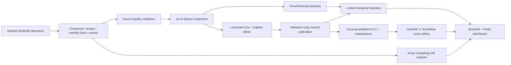

# Enterprise CLV & Customer Survival Analytics Platform

**An end-to-end data science portfolio project for enterprise storage customer intelligence.**

Estimate *when* an account may churn, translate survival into discounted recurring
contribution, and show whether a statistical model improves a fixed financial baseline.
The business sells physical storage arrays with recurring subscription and support
services. An asset replacement is a normal lifecycle event; losing the entire account
is a different outcome.

All data is **synthetic**, generated locally with seed 42. This project contains no
confidential company data, customer records, or claimed production deployments.

## Run locally

Python **3.11+**; tested end-to-end on Python 3.13. No cloud account, notebook, API key,
or GPU is needed.

```bash
python3 -m venv .venv
source .venv/bin/activate             # Windows: .venv\Scripts\activate
python -m pip install -r requirements.txt

python -m src.generate_data
python -m src.train
python -m src.score --backend duckdb
pytest -q
streamlit run dashboard/app.py
```

Open [localhost:8501](http://localhost:8501). Run commands from the repository root.
The three pipeline steps normally take seconds after dependencies are installed.
For a smaller development run, use `python -m src.generate_data --customers 500`,
then rerun training and scoring. Regenerate without that flag to restore 5,000 accounts.
`requirements.txt` specifies supported version ranges; `requirements-lock.txt`
records the exact environment used for the delivered run.

The dashboard gives setup instructions if artifacts are absent. Retraining changes
the model version; rerun scoring before opening the dashboard. Source fingerprints
prevent scoring a regenerated dataset with an older model. Only load the trusted
local `models/survival_bundle.joblib` artifact; pickle formats are executable.

## Measured results

<!-- GENERATED_RESULTS_START -->
Measured results from the seeded 5,000-customer run (regenerate with `python -m src.train`).

Test: 2024-12-31 → 2025-12-31; **3,100 active accounts**, **472 churn events**, Cox Harrell C-index **0.606**.

| Model | 12m MAE (USD) | 12m RMSE (USD) | 12m Brier |
|---|---:|---:|---:|
| baseline | 16,250.75 | 31,070.48 | 0.1308 |
| cox_raw | 16,158.42 | 29,813.01 | 0.1289 |
| cox_calibrated | 14,890.68 | 29,644.61 | 0.1266 |

Validation-fitted hazard multiplier: **0.845**. The calibration procedure was fixed before test evaluation; all three variants are reported, including regressions.

These are synthetic-data results, not evidence of real-world performance. The 24-month risk/CLV output is **not** validated by the 12-month test window.
<!-- GENERATED_RESULTS_END -->

The full breakdowns are generated in `outputs/test_financial.csv`,
`outputs/test_brier.csv`, and `outputs/test_calibration.csv`. `outputs/results.md`
is a compact shareable report. Validation-set results are also saved, but the
calibrated validation numbers are **in-sample for calibration**. Only test results
evaluate calibration out of time. No model was selected by its test-set score.

## Why survival analysis?

A binary churn classifier needs one arbitrary horizon and often discards or
mislabels customers whose follow-up is incomplete. A survival model estimates
`S(t) = P(account remains active beyond t)` at multiple horizons while handling
right-censored accounts. The timing matters: losing an account in month 2 has a
different financial consequence from losing it in month 22.

This project fits a penalized **Cox proportional hazards model** and a descriptive
**Kaplan–Meier** estimate with `lifelines`. It favors an interpretable, reliable
implementation over optional compiled survival forests. Scikit-learn supplies
training-only preprocessing and evaluation utilities.

## Architecture



The dashboard reads local materialized artifacts from the same scoring run as the
warehouse. It does not query a live production database or train models on page load.

## Synthetic data design

Default history: **January 2021–December 2025**, 60 calendar months. Acquisition is
staggered across the first 19 months, with a larger launch cohort. Churned accounts
have shorter histories. Five industries, three regions, three company-size segments,
and three storage product families create useful comparison dimensions.

| Table | Grain and key fields |
|---|---|
| `customers` | One account; ID, industry, region, company size, acquisition date |
| `arrays` | One installed asset spell; account FK, product, install date, capacity, scheduled EOS |
| `monthly_account_metrics` | Active account/month; utilization, data growth, tickets, incidents, ARR, expansion |
| `events` | Dated account or asset event; renewal, churn, replacement, EOS, expansion |

Each account starts with two or three arrays. Replacements create a **new array ID**
with higher capacity. Service lifetimes are 36–54 months. Most retiring arrays are
replaced; some reach normal end-of-service. Only actually installed arrays and
actually observed events are retained. Scheduled EOS remains on the asset record
because it was known at installation.

A persistent latent distress process affects utilization, support tickets, critical
incidents, expansion propensity, and monthly churn hazard. Annual renewal, approaching
initial hardware EOS, and a long period without expansion increase simulated risk.
Larger strategic accounts have lower underlying attrition. Latent distress and the
random hazard draws are **not exported as model features**. Customer dimensions are
immutable in this simulation. Expansion increases recurring ARR; hardware expansion
and one-time hardware sales are not modeled as separate financial cash flows.

The monthly convention is explicit: a customer that churns during month `m` has no
month-end metric or recurring contribution in `m`. Actual value and survival-weighted
value use this same convention. Partial-month billing is excluded.

## Leakage-safe features and temporal design

Every feature builder first filters all source facts to `event_date/month/install_date
<= scoring_date`. Retired assets are removed only using retirements already observed.
Current portfolio dimensions come from active assets, never the customer's eventual
product mix. A known future EOS schedule is usable; an unobserved future retirement is not.

Features include account age, time to the next annual renewal, previous renewals,
mean hardware age, nearest EOS, installed array count and capacity, current usage and
growth, 3-month usage change, 6-month least-squares usage slope, 1/3-month support
counts, 3-month incidents, ARR, 12-month ARR growth and expansion, and prior expansion
counts. `30d/90d` names refer to **one/three calendar-month buckets**, not exact daily
windows. Sparse history uses available windows and zero change for unavailable lags.
No active arrays uses a declared category, zero capacity/count, and an EOS sentinel
of 120 months. No future activity is forward-filled.

| Stage | Feature landmark | Outcomes available through | Use |
|---|---|---|---|
| Training | Dec 2021 **or** Dec 2022, one per customer | Dec 2023 | Fit Cox, scaling, encoded coefficients, KM |
| Validation | Dec 2023 | Dec 2024 | Fit one hazard-calibration multiplier |
| Test | Dec 2024 | Dec 2025 | Locked 12-month survival and financial evaluation |
| Latest scoring | Dec 2025 | Features only | 3/6/12/24-month forecasts |

The training landmark is assigned using immutable customer ID parity and acquisition
date, **before checking survival at that landmark**. Half of eligible early accounts
use December 2021; all others use December 2022. An account churned before its assigned
date is excluded from that risk set, rather than reassigned based on its outcome.
This provides up to 24 months of training follow-up without duplicating people in the
Cox fit. Labels are independently censored at the training knowledge cutoff.

Accounts can recur across train, validation, and test because the business task is
rescoring an existing book over time, not cold-start prediction for unseen customers.
IDs are never predictors. Encoders use a declared source-system vocabulary, and
scalers plus constant-column removal are learned only on training rows. Unknown
categories outside the supported vocabulary fail explicitly. An unseen training
category has no estimated category effect; other observed features still contribute.

Tests compare features built from the full database with features built from a database
truncated at the scoring date, and mutate/remove future facts to confirm invariance.
Historical scoring with a model calibrated after the requested date is rejected.

## Fixed business baseline

`config.json` holds assumptions committed before fitting:

| Assumption | Default |
|---|---:|
| Annual contract renewal probability | 90% |
| Monthly background churn | 0.1% |
| Annual expected ARR expansion | 4% |
| Recurring contribution margin | 72% |
| Annual discount rate | 10% |
| Forecast horizon / measured backtest horizon | 24 / 12 months |

Baseline survival has a renewal-probability drop at each account's next anniversary
plus monthly background attrition. The baseline and ML use identical margin,
expansion, discounting, and cash-flow conventions, isolating the survival estimate's
contribution to financial performance. Baseline assumptions and validation/test
forecasts are persisted **before the model is fit**.

## Survival, calibration, and metrics

Cox uses standardized numeric inputs, one-hot categorical inputs, and L2 penalization
of 0.1. Predictions hold the landmark covariates fixed and use the estimated baseline
survival curve. Requests beyond the 24-month training support are rejected. KM is
descriptive for the assigned-landmark training cohort; it is not presented as a
cohort-adjusted forecast for the current portfolio.

Calibration fits one positive multiplier `alpha` on validation 12-month log loss:

```text
S_calibrated(t) = S_raw(t) ** alpha
```

This preserves risk ranking and non-increasing survival, unlike fitting independent
probability corrections at each horizon. Alpha is constrained to `[exp(-2), exp(2)]`
for stability. The procedure is fixed in advance and applied even if some metrics
regress; raw and calibrated results are both disclosed. Calibration transfer from
12 to 24 months is an explicit assumption, not an established result.

Reported measurements:

- Harrell's concordance index for survival ranking on the test follow-up.
- Brier score at 3, 6, and 12 months, separately for baseline, raw Cox, and calibrated Cox.
- Predicted versus observed 12-month event risk by quantile bucket, with account counts
  and Wilson intervals for observed proportions.
- MAE, RMSE, mean signed error, forecast totals, and realized totals, aggregated and
  broken down by company size, dominant current product, and acquisition year.

Every validation/test landmark has complete administrative follow-up to 12 months
unless it churns first. Thus ordinary horizon-specific Brier scores equal the
censoring-adjusted calculation with censoring weights of one at those horizons.
The evaluator **raises on censoring before the requested horizon**. It does not
incorrectly label censored accounts as non-churners. For a real cohort with earlier
loss to follow-up, replace this restriction with an IPCW estimator and verify its
support assumptions; see the [scikit-survival Brier documentation](https://scikit-survival.readthedocs.io/en/latest/api/generated/sksurv.metrics.brier_score.html).

## Competing risks: choose the correct unit

**Account model:** customer churn is terminal. Replacement and EOS are nonterminal
hardware lifecycle events and never mark the account churn label.

**Asset model:** for each array spell, first terminal event is account churn,
array replacement, or normal EOS. These are mutually exclusive for the *old asset*.
A replacement starts a new spell under a new array ID while the account can remain
active. Right censoring occurs at the observation cutoff.

`src/competing_risks.py` implements the discrete Aalen–Johansen cumulative-incidence
recurrence directly, avoiding random jitter for tied monthly events:

```text
F_k(t) = F_k(t-) + S(t-) * d_k(t) / Y(t)
S(t)   = S(t-) * (1 - sum_k d_k(t) / Y(t))
```

Events precede censoring within a tied month-end; churn wins any source-level terminal
tie. Installations at the final cutoff have no follow-up and are excluded. CIFs plus
event-free probability sum to one, verified by tests. These curves are **descriptive
asset lifecycle statistics**, not input probabilities for customer CLV. Arrays are
correlated within an account, so naive independent-asset confidence intervals are
not shown. This avoids the incorrect approach of calling replacement a competing
terminal account event. [lifelines' Aalen–Johansen reference](https://lifelines.readthedocs.io/en/latest/fitters/univariate/AalenJohansenFitter.html)
describes the underlying estimator.

## CLV and account explanations

For end-of-month periods `t = 1..H`:

```text
CLV_H = sum_t S(t) * (ARR_0 / 12) * margin
              * (1 + annual_expansion)^(t/12)
              / (1 + annual_discount)^(t/12)
```

This is **finite-horizon discounted recurring contribution**, not total enterprise
value or accounting profit. Original hardware purchases are sunk at scoring time;
future hardware sales, acquisition costs, and intervention costs are excluded. The
backtest uses actual future ARR, the same margin, and the same discount factor.

`expected_remaining_lifetime` is retained for the requested warehouse contract but
means the **restricted expected active month-ends through 24 months** (`sum S(t)`),
not an extrapolated infinite lifetime. Revenue at risk is `current ARR * 12m risk`;
it is an exposure-prioritization proxy, not expected realized revenue loss.

Account explanations use exact terms `beta_j * (x_j - training_mean_j)` from the
Cox log relative hazard. They sum to the model's linear predictor, checked by test.
The dashboard shows both positive and negative contributions and the survival curve.
The exported coefficient table includes hazard ratios. These are model associations,
not causal claims. SHAP is unnecessary for this linear log-hazard model; no separate
classifier or fabricated importance score is used. Scalar calibration preserves
relative hazards. The [Cox model documentation](https://lifelines.readthedocs.io/en/latest/fitters/regression/CoxPHFitter.html)
provides the survival prediction API.

## Dashboard

- **Portfolio Overview:** active accounts, ARR, 24-month CLV, ARR exposure proxy,
  adjustable high-risk threshold, segment comparison, prioritized accounts, CSV export.
- **Risk Explorer:** risk distribution, revenue concentration, segment survival curves,
  and separately labeled asset competing-risk curves.
- **Customer Detail:** account context, 3/6/12/24-month risk, survival curve, CLV,
  exact upward/downward model contributions, and feature inspection.
- **Model Validation:** fixed test cohort, baseline/raw/calibrated financial errors,
  calibration buckets with uncertainty, C-index, Brier scores, subgroup results, KM,
  coefficient table, and downloadable results.

Customer segment, product, and region filters apply to portfolio/account exploration.
They do not modify locked validation results or the all-history asset CIF; those
exceptions are stated in the interface. Streamlit `AppTest` exercises all four pages
after the pipeline has created its artifacts.

## Warehouse and Snowflake

`src/database.py` exposes `write_table`, `query`, and `close` across both backends.
Local execution creates `data/warehouse.duckdb`. Source tables, `account_features`,
and `customer_risk_scores` are published by `src.score`. SQL DDL is Snowflake-compatible;
the DDL and example feature/portfolio queries are executed against DuckDB in tests.
Python computes the full feature set; `sql/05_asof_feature_example.sql` demonstrates
the equivalent as-of pattern for a support window.

To enable the optional Snowflake adapter:

```bash
python -m pip install -e '.[snowflake]'
cp .env.example .env
# Fill in the Snowflake account, user, password, warehouse, database, and schema.
python -m src.score --backend auto
```

No credentials are stored in source control. `auto` uses DuckDB if credentials,
the connector, or the Snowflake connection are unavailable. `--backend snowflake`
fails explicitly if unavailable, which is preferable for scheduled production jobs.
Connection errors log only the exception class to avoid exposing credentials.
A connected Snowflake write failure is surfaced, not silently redirected elsewhere.

Writes replace **current snapshot tables**; they do not append scoring history.
Use a dedicated project schema. Local table replacement is atomic per table;
the entire multi-table publish is not a single transaction. The adapter infers
warehouse types from DataFrames, with the SQL scripts as the documented contract.
Python enforces source relationships, score completeness, uniqueness, finite values,
monotonic risks, and financial bounds before publishing. Snowflake connection and
write code is implemented but was not cloud-tested without credentials.

## Repository map

```text
config.json                  Reproducible experiment and financial assumptions
src/
  generate_data.py            Longitudinal synthetic source tables
  data_quality.py             Key, exposure, and business-value checks
  features.py                 As-of covariates and right-censored labels
  baseline.py / clv.py        Fixed financial baseline and discounted value
  survival.py                Training-only preprocessing, Cox, Kaplan–Meier
  calibration.py             Hazard recalibration and supported-horizon Brier
  competing_risks.py          Array spells and discrete Aalen–Johansen curves
  backtesting.py              Landmark assignment and realized-value evaluation
  explainability.py          Exact log-hazard contribution decomposition
  database.py                DuckDB / optional Snowflake abstraction
  train.py / score.py         Reproducible CLI entry points
dashboard/app.py             Four-view Streamlit application
sql/                        Warehouse contracts and executable analysis queries
tests/                      Business, leakage, model, SQL, and dashboard tests
notebooks/                  Optional exploration; no required manual steps
data/                       Generated Parquet tables and local DuckDB database
models/                     Fitted model bundle
outputs/                    Scores, validation tables, curves, reports, manifests
.github/workflows/ci.yml     Python 3.11 smoke pipeline, tests, lint
```

Large datasets, model binaries, warehouse files, and detailed generated CSV/Parquet
outputs are gitignored. Small JSON summaries and `outputs/results.md` document the
measured run. Recreate all artifacts using the commands above. The run manifest records
configuration, package versions, code/source hashes, and an artifact version. The
scoring timestamp is intentionally wall-clock metadata, not a reproducible prediction.

## Limitations and next steps

The project is an executable portfolio system, not a claim of production readiness
for a real company's decisions. In particular:

- Synthetic signals and fixed financial assumptions cannot establish real business lift.
  Calibrated performance remains modest; individual forecasts retain material uncertainty.
- Cox assumes proportional hazards and fixed future covariates. Contract seasonality,
  cohort aging, and regime changes can violate these assumptions. Formal proportional-
  hazards diagnostics, time-varying effects, and a discrete-time hazard challenger are
  reasonable next steps.
- Training landmarks differ in follow-up and tenure; the long-horizon curve relies
  mainly on the early cohort. We report only 12-month out-of-time metrics and do not
  infer 24-month calibration from them.
- This is one locked temporal holdout, not rolling-origin cross-validation. Future work
  should add more historical cutoffs and customer-block bootstrapped financial intervals.
- Future ARR expansion is a common fixed assumption, not a trained conditional revenue
  model. A separate expansion model could improve CLV without changing churn ranking.
- The simulated EOS contribution to churn uses the initial asset schedule. A full
  production simulator would update hazard exposure as the installed base changes.
- Immutable dimensions and on-time source arrival simplify as-of joins. Real ingestion
  needs availability timestamps, slowly changing dimensions, event revisions, and
  data-quality monitoring. No reactivation is modeled after terminal churn.
- Artifact lineage checks and schema validation are included; authentication, retention
  workflows, model serving, distributed scheduling, drift alerts, and cloud transaction
  management remain deployment work.

An interview walkthrough can start with the unit-of-analysis decision, show the
future-mutation leakage test, explain why calibration changes dollar forecasts, then
compare actual test errors and inspect a single account's exact risk contributions.
